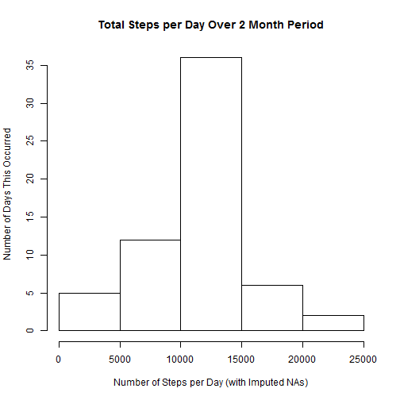

## Introduction

This R markdown document was created for the Coursera course Reproducible Research Peer Assessment 1 Project. The goal of the project is to use an R markdown document to convey results of analyzing activity monitoring data from an anonymous individual.

When running this file, ensure you are in the correct working direcotry that contains this file and the activity.csv file.

**Required Packages: plyr, chron, lattice**

## Loading and Preprocessing the data

The first step is to load the data from the activity.csv file which was provided with the assignment instructions. If this data has already been loaded previously, R will retrieve the data frame from the cache.


```r
activityData <- read.csv(file = "activity.csv", header=TRUE)
activityData$date <- as.Date(activityData$date)
summary(activityData)
```

```
##      steps             date               interval     
##  Min.   :  0.00   Min.   :2012-10-01   Min.   :   0.0  
##  1st Qu.:  0.00   1st Qu.:2012-10-16   1st Qu.: 588.8  
##  Median :  0.00   Median :2012-10-31   Median :1177.5  
##  Mean   : 37.38   Mean   :2012-10-31   Mean   :1177.5  
##  3rd Qu.: 12.00   3rd Qu.:2012-11-15   3rd Qu.:1766.2  
##  Max.   :806.00   Max.   :2012-11-30   Max.   :2355.0  
##  NA's   :2304
```

## What is the Mean Total Number of Steps Taken Per Day?

To answer this question, we must first calculate the total number of steps taken per day, ignoring all 'NA' values in the dataset.


```r
stepTotals <- aggregate(steps ~ date, activityData, sum)
summary(stepTotals)
```

```
##       date                steps      
##  Min.   :2012-10-02   Min.   :   41  
##  1st Qu.:2012-10-16   1st Qu.: 8841  
##  Median :2012-10-29   Median :10765  
##  Mean   :2012-10-30   Mean   :10766  
##  3rd Qu.:2012-11-16   3rd Qu.:13294  
##  Max.   :2012-11-29   Max.   :21194
```

Next, we create a histogram of the number of steps taken per day.


```r
hist(stepTotals$steps, xlab = "Number of Steps per Day", ylab = "Number of Days This Occurred",
     main = "Total Steps per Day Over 2 Month Period")
```

 

Finally, we calculate the mean and median of the total number of steps taken per day.


```r
meanSteps <- mean(stepTotals$steps)
medianSteps <- median(stepTotals$steps)
```

Mean: 10766

Median: 10765

## What is the Average Daily Activity Pattern?

First we calculate the average number of steps taken in each interval, taking the average across all days.


```r
avgInterval <- aggregate(steps ~ interval, activityData, mean)
```

We can then create a time-series plot of the 5 minute interval and the averages for those intervals.


```r
plot(avgInterval$interval, avgInterval$steps, type = "l",
     xlab = "5 Minute Intervals", ylab = "Average # of Steps",
     main = "Average # of Steps For Each 5 Minute Interval Across All Days")
```

 

The next set of code calculates the 5 minute interval which has the highest average number of steps.


```r
maxInterval <- avgInterval[avgInterval$steps == max(avgInterval$steps), ]
```

The 5 minute interval with the highest average number of steps occurs in interval 835.

## Imputing Missing Values

In order to accomplish this task, we must first determine the total number of NAs in the dataset. The steps column is the only column with NAs, so we can focus on that.


```r
totNA <- sum(is.na(activityData$steps))
```

The total number of rows with the steps equal to NA is 2304.

To replace these missing values, we will use the mean of that interval. For example, if interval 10 has a value of NA for any given day, we will use the mean calculated in the previous section for interval 10, which is 0.1320755.


```r
splitInt <- split(activityData, activityData$interval)
int <- seq(from = 1, to = 288, by = 1)
for(i in int){
      curInt <- splitInt[[i]]$interval[1]
      naRows <- is.na(splitInt[[i]]$steps)
      splitInt[[i]]$steps[is.na(splitInt[[i]]$steps) == TRUE] <- avgInterval$steps[avgInterval$interval == curInt]
}
```

At this point, we have all of the values filled in but they are in a list of data frames. We will convert the list of data frames back into one data frame that is similar to the original activity data, but with the NA values filled in.

This section require the **plyr** package.


```r
library(plyr)
df <- ldply(splitInt, data.frame)
df2 <- df[c("steps", "date", "interval")]
filledData <- arrange(df2, date, interval)
summary(filledData)
```

```
##      steps             date               interval     
##  Min.   :  0.00   Min.   :2012-10-01   Min.   :   0.0  
##  1st Qu.:  0.00   1st Qu.:2012-10-16   1st Qu.: 588.8  
##  Median :  0.00   Median :2012-10-31   Median :1177.5  
##  Mean   : 37.38   Mean   :2012-10-31   Mean   :1177.5  
##  3rd Qu.: 27.00   3rd Qu.:2012-11-15   3rd Qu.:1766.2  
##  Max.   :806.00   Max.   :2012-11-30   Max.   :2355.0
```

We can repeat what we did in the first section using our new data set and compute the total number of steps per day, then calculate the mean and median for each day.


```r
stepTotals2 <- aggregate(steps ~ date, filledData, sum)
summary(stepTotals2)
```

```
##       date                steps      
##  Min.   :2012-10-01   Min.   :   41  
##  1st Qu.:2012-10-16   1st Qu.: 9819  
##  Median :2012-10-31   Median :10766  
##  Mean   :2012-10-31   Mean   :10766  
##  3rd Qu.:2012-11-15   3rd Qu.:12811  
##  Max.   :2012-11-30   Max.   :21194
```

```r
meanSteps2 <- mean(stepTotals2$steps)
medianSteps2 <- median(stepTotals2$steps)
```

Mean (Original): 10766

Mean (New): 10766

Median (Original): 10765

Median (New): 10766

As you can see, the values between the original mean & median and the new mean & median which have the NAs filled in with the average of the associated 5 minute interval are not very different from each other. While the total number of steps per day increases (as seen in the histogram below), the mean and median stay the same.


```r
hist(stepTotals2$steps, xlab = "Number of Steps per Day (with Imputed NAs)", 
     ylab = "Number of Days This Occurred", main = "Total Steps per Day Over 2 Month Period")
```

 

## Are There Differences in Activity Patterns Between Weekdays and Weekends?

First we need to determine whether each day in the data is a weekend of weekday. This will be added as a new column to the data frame.

This section requires the **chron** package.


```r
library(chron)
filledData$WeekDay <- is.weekend(filledData$date)
filledData$WeekDay <- mapvalues(filledData$WeekDay, from = c("TRUE", "FALSE"), to = c("weekend", "weekday"))
```

We can then make a panel plot containing a time series plot of the 5 minute intervals and the average number of steps taken in each interval, this time averaged across all weekday days or weekend days.

This section requires the **lattice** package.


```r
library(lattice)
avgIntervalWeekend <- aggregate(steps ~ interval, data = filledData, 
                            subset = filledData$WeekDay == "weekend", mean)
avgIntervalWeekend$WeekDay <- "weekend"
avgIntervalWeekday <- aggregate(steps ~ interval, data = filledData, 
                            subset = filledData$WeekDay == "weekday", mean)
avgIntervalWeekday$WeekDay <- "weekday"
allAvgs <- rbind(avgIntervalWeekend, avgIntervalWeekday)
## Create the plot
l <- xyplot(steps ~ interval | WeekDay, data = allAvgs, type = "l",
                  ylab = "Number of Steps",
                  main = "Five Minute Interval")
print(l)
```

 
